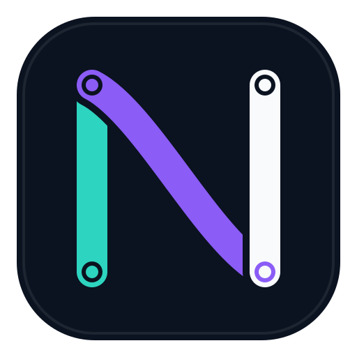

# Nodebraid

**让每一次改动，清晰相连。**

Nodebraid 是一个帮助你管理代码改动的桌面软件。它把常用的 Git 操作做成了看得见、点得动的按钮，让你不用背命令，也能知道“我改了什么、保存了什么、有没有传到远端”。



它可以在 Windows、macOS 和 Linux 上运行。目前是 `0.1.0` 早期版本，先把日常最常用、风险较低的事情做好。

## 先用一句大白话说明 Git

你可以把一个项目想成一本正在修改的书：

| 名词 | 大白话解释 |
| --- | --- |
| 仓库（Repository） | 装着这本书和所有历史版本的文件夹 |
| 暂存（Stage） | 把准备保存的改动先放进一个篮子 |
| 提交（Commit） | 给篮子里的改动拍一张有说明的存档照片 |
| 拉取（Pull） | 把远端的新内容拿到自己的电脑 |
| 推送（Push） | 把自己保存好的提交传到远端 |

请记住：**提交只是保存在本机，推送才会把内容传出去。**

## Nodebraid 能帮你做什么

- 打开电脑里已有的 Git 项目。
- 看清哪些文件被修改、新增或删除。
- 点开文本文件，查看具体改了哪几行。
- 一次选择一个或多个文件进行暂存、取消暂存。
- 写一句说明并创建提交。
- 获取、拉取和推送远端内容。
- 查看最近 200 条提交记录。
- 查看和切换本地分支。
- 使用中文或英文界面。

它目前不会替你做强制推送、重置、变基、删除未跟踪文件或改写历史。这些操作容易造成无法恢复的损失，所以早期版本先不提供。

## 使用前要准备什么

电脑上需要先安装好 Git。Nodebraid 使用的是你电脑里的 Git，也继续使用你原来配置好的 SSH 或系统凭据，不会要求你把 GitHub 密码或访问令牌存进软件。

如果不知道 Git 是否安装好了，可以打开终端或命令提示符，输入：

```sh
git --version
```

能看到版本号，就说明 Git 可以使用。

## 第一次使用

1. 打开 Nodebraid，点击“打开仓库”。
2. 选择一个已经是 Git 仓库的项目文件夹。
3. 在“改动”页面查看未暂存和已暂存的文件。
4. 选中这次想保存的文件，点击“暂存”。
5. 写一句能说明本次修改的文字，例如“修正登录按钮颜色”。
6. 点击“提交”。这时内容只保存在你的电脑里。
7. 确认远端设置正确后，再点击“推送”把提交传出去。

如果“拉取”或“切换分支”时还有没保存的改动，Nodebraid 会先提醒你。遇到看不懂的提示时，先不要反复点击，把提示内容和项目备份保留下来再处理。

## 安装

仓库所有者可以在 GitHub 的 Releases 页面提供安装包。请只安装来自你信任来源的文件。

目前的本地测试包没有付费代码签名证书，因此 macOS 或 Windows 可能显示“开发者未验证”之类的系统提示。正式公开发布前，应配置对应平台的签名证书。

## 从源码运行

如果你是开发者，需要安装 Node.js 24 和 npm，然后在项目目录执行：

```sh
npm ci
npm start
```

运行测试：

```sh
npm test
```

生成当前系统的未签名应用目录：

```sh
npm run pack
```

生成当前系统的安装包：

```sh
npm run dist
```

Windows、macOS 和 Linux 的正式安装包应分别在对应系统上构建。带版本号的 Git 标签可以触发仓库中的自动打包流程。

## 安全和隐私

Nodebraid 的原则是：重要操作由你主动点击，软件不在背后替你改仓库。

- Git 命令不会通过系统 Shell 拼接执行。
- 文件路径会在主进程中检查。
- 会修改仓库的操作一次只执行一个。
- 拉取只允许快进；不能安全快进时会停止，不会偷偷改写历史。
- 不会自动解决冲突，也不会自动同步。
- 不收集使用统计。
- 不上传仓库内容、差异、提交说明或环境变量。
- 最近打开的仓库、语言和 Git 路径等设置只保存在本机。

即使软件采用了保守设置，重要项目仍然应该保留备份，并使用 GitHub 等平台提供的访问控制和分支保护。

## 项目状态

这是一个从零独立实现的早期 MVP，适合试用、学习和继续开发。功能建议、缺陷报告和代码贡献方式见 [CONTRIBUTING.md](CONTRIBUTING.md)，安全问题报告方式见 [SECURITY.md](SECURITY.md)。

## 开源许可证

Nodebraid 采用 [MIT 许可证](LICENSE) 开源。你可以使用、修改和分发本项目，但需要保留原有的版权声明和许可证文本。

第三方组件仍遵守各自的许可证，详见 [THIRD_PARTY_NOTICES.md](THIRD_PARTY_NOTICES.md)。

---

**English summary:** Nodebraid is a calm, bilingual desktop client for common Git tasks. It focuses on clear, explicit, non-destructive workflows and does not collect telemetry or store hosting credentials.
